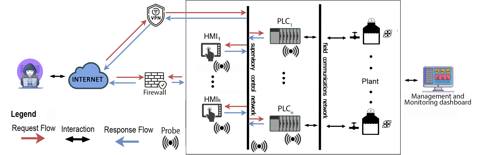
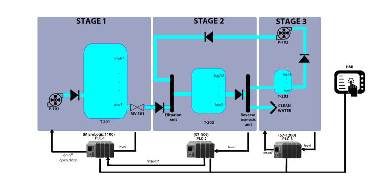
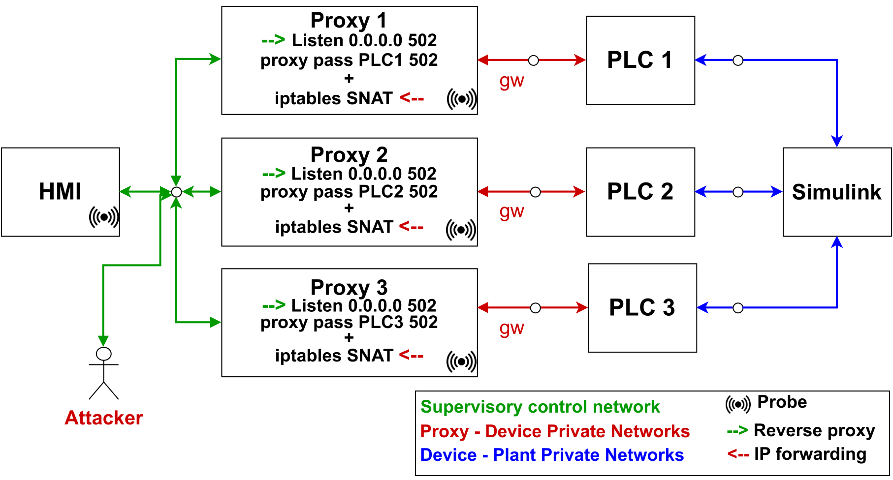

# HoneyICS: A High-interaction Physics-aware Honeynet for Industrial Control Systems

This repository contains the source code and necessary files for the paper "HoneyICS: A High-interaction Physics-aware Honeynet for Industrial Control Systems".

## Abstract

Industrial control systems (ICSs) are vulnerable to cyber-physical attacks, i.e., security breaches in cyberspace that adversely affect the underline physical processes. In this context, honeypots are ideal countermeasures both to defend against such attacks and discover new attack strategies. In recent years, Honeypots for ICSs have made several progresses in trying to faithfully reproduce the behavior of OT networks, including physical process interactions. We propose a high-interaction, physics-aware, scalable, and extensible honeynet for ICSs, equipped with an advanced monitoring system. We deployed our honeynet on the Internet and conducted experiments to compare it with existing ICS honeypots.


## Contents

This repository contains the following directories:

- **PLCs**

    This directory contains the source code to build the software PLC that can be used in the honeynet. The PLCs' codes are implemented in ladder logic and are designed to simulate the behavior of real-world ICSs.

- **Proxy**

    This directory contains the source code for the proxy servers used in the honeynet. The proxies are responsible for forwarding traffic between the PLCs.

- **Matlab Simulink**

    This directory contains the source code for the Matlab Simulink models used in the honeynet and the Dockerfile to build the container. The models are used to simulate the physical processes controlled by the PLCs. To run it you will need an active Matlab License

 - **Attacks**

    This directory contains the attack files used in the experiments conducted in the paper. The directory is further divided into subdirectories for each attack. Each subdirectory contains the necessary files to execute the attack, including scripts, payloads, and configuration files.

## Overview

Within this repository, we have provided detailed instructions on how to successfully replicate our honeynet and execute the attacks outlined in our published article.

> While it is possible to install all necessary components on a singular machine, we highly recommend allocating the simulink container to a distinct device in order to circumvent any unforeseen issues arising from potential RAM depletion.



The honeynet comprises several components:  HMIs, PLCs, proxies, plant, management and  monitoring dashboards, and probes. Each element is containerized using Docker technology.

Specifically, the HMI component is built using ScadaBR, and its container is designed to automatically generate a view using a headless version of Selenium. Additionally, the HMI container connects to the PLCs using the entries plc1.net, plc2.net, and plc3.net, which may need to be modified to suit your specific configuration.

The PLC container, is built using  [OpenPLC](https://openplcproject.com/) and  [HoneyD](https://www.honeyd.org/) , with the use of  [HoneyPLC](https://github.com/sefcom/honeyplc) improvements. The PLCs are automatically loaded with the ladder logic for the use case illustrated below.

### Use case


The use case, we considered is inspired by
[Lanotte et al.](https://arxiv.org/abs/2105.10668), consisting of a network of three PLCs to control
(a simplified version of) the [iTrust Secure Water Treatment system](https://ieeexplore.ieee.org/stamp/stamp.jsp?tp=&arnumber=7469060&tag=1) (SWaT).
For simplicity, we consider only three stages, with three tanks.

- Stage 1:

    -   Raw water is pumped into an 80-gallon tank T-201 via pump P-101.
    -   A valve MV-301 connects tank T-201 to a filtration unit that releases treated water into a second tank T-202 (with a capacity of 20 gallons).
    -   Water in T-202 flows into a reverse osmosis unit to reduce inorganic impurities.

- Stage 2:

    -   PLC-1 manages tank T-201 and controls the water level.
    -   PLC-2 manages tank T-202 and controls the valve opening/closing.
    -   The valve remains open when the tank is refilling and closed when it is emptying.
    -   If the water level in T-201 reaches its low setpoint, the pump is turned on and the valve is closed. If it reaches its high setpoint, the pump is turned off.

-  Stage 3:

    -   PLC-3 manages the backwash tank T-203 and controls the pump P-102.
    -   If the water level in T-203 reaches the low setpoint, the pump is turned off. If it reaches the high setpoint, the entire content of T-203 is pumped back into the filtration unit of T-202.

-  Additional: 
    - The HMI is used to visualize the status of the three tanks and their components.

### Network
The expected network outcome of the honeynet is illustrated in the following picture.



To ensure secure communication and prevent lateral movement, each PLC is situated on an individual network with a proxy serving as its default gateway. These proxies are strategically positioned in front of the PLCs, enabling bi-directional communication management. 

Moreover, the placement of probes directly on the proxy will facilitate the seamless capture of data transmitted to physical devices, providing scope for future enhancement.

## Setup

In each subdirectory where it is deemed necessary, comprehensive guidelines on utilizing each component of the honeynet can be found within the README.md file.


### Prerequisites for the honeynet

1. Make sure your system meets the requirements for installing Docker.
2. Install Docker:
    1. Update your package manager’s index:
        - On Ubuntu: `sudo apt-get update`
        - On Fedora: `sudo dnf check-update`
    2. Install Docker Engine:
        - On Ubuntu: `sudo apt-get install docker-ce docker-ce-cli containerd.io`
        - On Fedora: `sudo dnf install docker-ce docker-ce-cli containerd.io`

3. Verify installation: Open a terminal or command prompt and run the command `docker --version` to verify that Docker has been installed successfully.

4. Install Kibana and Elastic:
    1. Pull Elasticsearch image: In a terminal session, pull the Elasticsearch image from Docker Hub by running the command: `docker pull docker.elastic.co/elasticsearch/elasticsearch:8.6.2`
    
    2. Start Elasticsearch container: Start an Elasticsearch container by running the command: `docker run --name es-01 -p 9200:9200 -p 9300:9300 -e "discovery.type=single-node" docker.elastic.co/elasticsearch/elasticsearch:8.6.2`
    
    3. Pull Kibana image: In a new terminal session, pull the Kibana image from Docker Hub by running the command: `docker pull docker.elastic.co/kibana/kibana:8.6.2`

    4. Start Kibana container: Start a Kibana container and connect it to your Elasticsearch container by running the command: `docker run --name kib-01 --net elastic -p 5601:5601 docker.elastic.co/kibana/kibana:8.6.2`

5. Install IPtables:

    1.  **Update package manager:**  Update your package manager by running the command: ` sudo apt update`
        
    2.  **Install iptables:**  Install iptables by running the command: `sudo apt install iptables`
        
    3.  **Check iptables status:**  Check the status of your current iptables configuration by running the command: `sudo iptables`

6. Install OpenVPN server:

    1. **Download the OpenVPN Server tar**

    2. Launch the following command `tar xfz openvpn-[version].tar.gz`

    3. `cd `into the directory an run the following commands:
        ```
        ./configure
        make
        make install
        ```

### Prerequisites for the attacker
In order to properly configure the attacker machine for the purposes of this experiment, it is necessary to install and set up several specific tools and libraries. These include:
- Python
- Pymodbus
- Easymodbus
- Dsniff
- IPtables
- OpenVPN client


1. **Python**
    1.  **Update package manager:**  Update your package manager by running the command: ` sudo apt update `
        
    2.  **Install Python versions:**  Install both versions of Python by running their respective commands:
        
        -   For Python 3.7:  `sudo apt install python3.7`
        -   For Python 2.7:  `sudo apt install python2.7`
    3.  **Install pip:**  Install pip for both versions of Python by running their respective commands:
        
        -   For Python 3.7:  `sudo apt install python3-pip`
        -   For Python 2.7:  `sudo apt install python-pip`

    4. **Check if everything is installed correctly** by running the following commands:

        1.  **Check Python versions:**  Check the installed versions of Python by running their respective commands:
            
            -   For Python 3.7:  `python3.7 --version`
            -   For Python 2.7:  `python2.7 --version`
        2.  **Check pip versions:**  Check the installed versions of pip by running their respective commands:
            
            -   For pip3:  `pip3 --version`
            -   For pip2:  `pip2 --version`

2. **Python Libraries**
    
    1.  Install  pymodbus  using the  pip command:  `pip install pymodbus`
        
    2.  Install  easymodbus using the pip command: `pip install easymodbus`
        
    3.  Once the installation is complete, you can import the modules:
        
        ```
        import pymodbus
        import easymodbus
        ```

3. **Dsniff**

    1.  Install  dsniff  using the  package manager  of your operating system. On a Debian-based system, you can use the  apt package manager: `sudo apt-get install dsniff`
        
    2.  Once the installation is complete, you can use the command-line interface to run the various tools included in  `dsniff`.

    >`dsniff`  is a collection of tools for network auditing and  penetration testing. It includes tools for sniffing passwords, analyzing network traffic, and performing man-in-the-middle attacks.
    Some of the tools included in  `dsniff`  are:
        >-   `arpspoof`: to redirect packets from a target host to the attacker's machine.
        >-   `dnsspoof`: to forge  DNS responses  to redirect traffic to a different IP address.
        >-   `urlsnarf`: to capture URLs visited by users on the network.
        >-   `tcpkill`: to terminate  TCP connections.
        >-   `mailsnarf`: to capture email traffic on the network.
        >-   `filesnarf`: to capture files transferred over the network.

4. **IPtables**
    
    1. iptables  is typically pre-installed on most Linux distributions.

        -   If  `iptables`  is not already installed on your system, you can install it using the  package manager  of your operating system. On a Debian-based system, you can use the  apt package manager:`sudo apt-get install iptables`

5. **OpenVPN client**

    1. Install the  OpenVPN client  using the  package manager  of your operating system. On a Debian-based system, you can use the  apt package manager: `sudo apt-get install openvpn`

## Usage

To use the source code and attack files in this repository, follow these steps:

1.  Clone the repository to your local machine.
2.  Install the necessary dependencies for the PLCs, proxy servers, and Matlab Simulink models.

    1. Build the images for all the containers:
        ```
        docker build -t plc1 /PLCs/PLC1
        docker build -t plc2 /PLCs/PLC2
        docker build -t plc3 /PLCs/PLC3
        docker build -t hmi /HMI/ScadaBR
        docker build -t proxy /proxy        
        docker build -t plant /PLANT/simulink
        ```

    2. Run the containers:
        ```
        docker run --name plc1 plc1 -p 6668:6668/udp 
        
        docker run --name plc2 plc2 -p 6668:6668/udp 

        docker run --name plc3 plc3 -p 6668:6668/udp 

        docker run --name hmi hmi 

        docker run --rm --cap-add=NET_ADMIN -v "$(pwd)"/nginx.conf:/etc/nginx/nginx.conf:ro --name proxy1 proxy

        docker run --rm --cap-add=NET_ADMIN -v "$(pwd)"/nginx.conf:/etc/nginx/nginx.conf:ro --name proxy2 proxy

        docker run --rm --cap-add=NET_ADMIN -v "$(pwd)"/nginx.conf:/etc/nginx/nginx.conf:ro --name proxy3 proxy   

        docker run --name plant plant 
        ```

    3. Create the virtual networks for the PLCs:
        ```
        docker network create -d macvlan --subnet=192.168.3.0/24  --gateway=192.168.3.1 -o parent=ens224  plc1-macvlan-net

        docker network create -d macvlan --subnet=192.168.4.0/24  --gateway=192.168.4.1 -o parent=ens192  plc2-macvlan-net

        docker network create -d macvlan --subnet=192.168.5.0/24  --gateway=192.168.5.1 -o parent=ens256  plc3-macvlan-net
        ```
    
    4. Connect the containers with the proxies and the PLCs to their network:
        ```
        docker network connect plc1-macvlan-net plc1
        docker network connect plc1-macvlan-net proxy1
        docker network connect plc2-macvlan-net plc2
        docker network connect plc2-macvlan-net proxy2
        docker network connect plc3-macvlan-net plc3
        docker network connect plc3-macvlan-net proxy3
        ```

    5. Create the virtual networks for the plant:
        ```
        docker network create -d macvlan --subnet=192.168.6.0/24  --gateway=192.168.6.1 -o parent=ens160  plc1-sim-macvlan-net

        docker network create -d macvlan --subnet=192.168.7.0/24  --gateway=192.168.7.1 -o parent=ens161  plc2-sim-macvlan-net
        
        docker network create -d macvlan --subnet=192.168.8.0/24  --gateway=192.168.8.1 -o parent=ens162  plc3-sim-macvlan-net
        ```

    6. Connect the PLCs to the plant network:
        ```
        docker network connect plc1-sim-macvlan-net plc1
        docker network connect plc2-sim-macvlan-net plc2
        docker network connect plc3-sim-macvlan-net plc3

        docker network connect plc1-sim-macvlan-net hmi
        docker network connect plc2-sim-macvlan-net hmi
        docker network connect plc3-sim-macvlan-net hmi
        ```

    7. Route the traffic between the proxy and the PLCs:
         ```
        docker exec -it plc1 ip route del default

        docker exec -it plc1 ip route add default via 192.168.3.3 dev eth0

        docker exec -it plc2 ip route del default

        docker exec -it plc2 ip route add default via 192.168.4.3 dev eth0

        docker exec -it plc3 ip route del default

        docker exec -it plc3 ip route add default via 192.168.5.3 dev eth0

        docker exec -it proxy1 iptables -t nat -A POSTROUTING -o eth0 -j SNAT --to 192.168.2.2 
        # all the packets that go out of proxy1 will have its ip src address

        docker exec -it proxy2 iptables -t nat -A POSTROUTING -o eth0 -j SNAT --to 192.168.2.3

        docker exec -it proxy3 iptables -t nat -A POSTROUTING -o eth0 -j SNAT --to 192.168.2.4

        ```

3.  Configure the honeynet according to your needs.
4.  Run the honeynet.
5.  Execute the attack files to test the honeynet's effectiveness.

## Disclaimer

The attack files presented in this paper are intended for demonstration purposes only. They should not be used to harm real Industrial Control Systems (ICS). The authors of this paper do not condone any malicious use of the information provided and will not be held responsible for any damages resulting from such actions.

## License

This repository is licensed under the MIT License. See the LICENSE file for more information.
